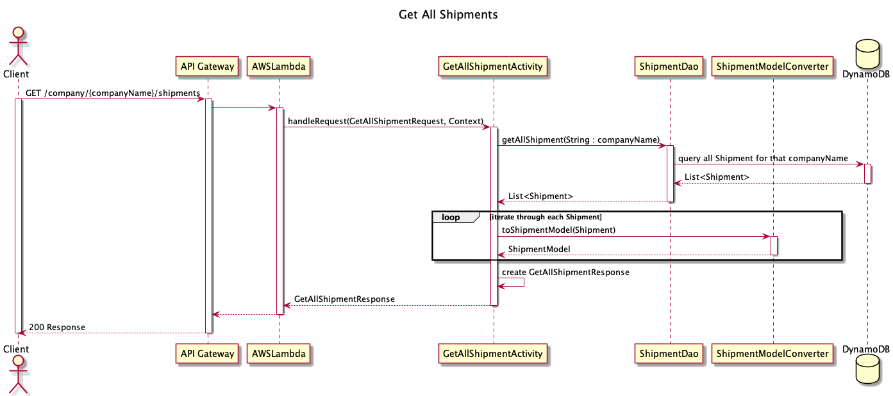

# Shopify Inventory Manager Design Document

# Inventory Manager
Inventory is an effective way to manage all your inventory and shipping. It helps to keep track of all the active and inactive products. 
It also helps to create shipment orders and keep track of all shipments at one place.


### Live Project Preview:

[Inventory Manager Application](link)

#### For Testing, You can use dummy account to login
    Username: Pepsico
    Password: Pepsi@12345

Note: There is a 2-3 seconds latency to establish a connection. 

### Technologies Used :
* Java, DynamoDB, AWS S3, AWS Lambda, AWS API Gateway, React, Bootstrap, AWS Amplify (for hosting)

## API Documentation
[InventoryManager API Documentation](Link)

## 1. Problem Statement

Managing inventory is one of the core requirements for a logistic business. Inventory Manager is application management service for 
companies such as logistics company to create products and keep track of all active and inactive products with quantity and cost.
With Inventory Manager, you can also create shipments and easily monitor the state of all shipments at a glance.

## 2. Features Included
1. Create product (inventory) items
2. Update product
3. Delete product with delete comments
4. View list of active products
5. View List of inactive products
6. Undelete product
7. Create shipment (adjust inventory)
8. Update Shipment
9. Get Shipment
10. Get list of shipments
11. Signup with company name, email address and password
12. Signin/Signout using company name and password

## 3. Use Cases

U1. *As a InventoryManager customer, I want to create my own account*

U2. *As a InventoryManager customer, I want to create new product*

U3. *As a InventoryManager customer, I want to update existing product (description, quantity, cost, name) *

U4. *As a InventoryManager customer, I want to delete a product with delete comments*

U5. *As a InventoryManager customer, I want to view all my inactive products*

U6. *As a InventoryManager customer, I want to undelete a product*

U7. *As a InventoryManager customer, I want to create shipment and my inventory should automatically be reduced*

U8. *As a InventoryManager customer, I want to update shipment (tracking number, address, status)*

U8. *As a InventoryManager customer, I want to update status of shipment using dropdown menu*


# 4. Proposed Architecture Overview


We will use API Gateway and Lambda to create 13 endpoints
( `CreateCompany`, `GetCompany`,  `CreateProduct`, `UpdateProduct`, `GetProduct`,
`GetAllActiveProduct`, `GetAllInactiveProduct`,  `DeleteProduct`, `UndeleteProduct`,
`CreateShipment`, `UpdateShipment`, `GetShipment`, `GetAllShipment`) that will handle the
creation, updating, and retrieval of companies products and shipments.

We will store Companies (users), Products, Shipments in DynamoDB database. 

# 5. Class Diagram (UML) 

High Level overview of the project structure


# 6. API

## 6.1. Public Models

To avoid sending direct database object to the user, every object is converted to a public model.
This improves the security of the data stored in the database (DynamoDB).

```
// CompanyModel

String companyName;
String createdAt;
String emailAddress;
```

```
// ProductModel

String companyName;
String sku;
String name;
String description;
int quantity;
BigDecimal cost;
boolean isActive;
String deleteComment;
```

```
// ShipmentModel

String companyName;
String shipmentId;
String createdAt;
String shippingAddress;
String status;
String trackingNumber;
Map<String, Integer> productsShipped;

```

### 6.2. Get Company Endpoint

* Accepts `GET` requests to `/company/:companyName`
* Accepts a companyName and returns the corresponding CompanyModel.
    * If the given companyName is not found, will throw a
      `CompanyFoundException`
    * If password does not match for the company, will throw a
      `InvalidPasswordException`


### 6.3. Create Company Endpoint

* Accepts `POST` requests to `/company`
* Accepts data to create a new company with a provided companyName, emailAddress and password.
* companyName needs to be unique. 
    * If the companyName already exists, will throw an
      `CompanyNameAlreadyExistsException`.
* For security concerns, we will validate the provided company email address is valid
    * If the email address is not a valid format, will throw an
      `InvalidAttributeValueException`.
* For security concerns, we will validate the password is at least 6 characters long
    * If the password is invalid, will throw an
      `InvalidAttributeValueException`.


### 6.4. Create Product Endpoint

- Accepts `POST` requests to `/company/:companyName/products`
- Accepts data to create a product. Product sku needs to be unique.
- If quantity or cost is less than zero, throws an `InvalidAttributeValueException`
- If sku already exists, throws an `ProductAlreadyExistsException`


### 6.5. Update Product Endpoint

- Accepts `PUT` requests to `/company/:companyName/products/:sku`
- Accepts a companyName and sku, and optional updated attributes such as quantity, cost, name, description. 
Returns the updated product.
- If product sku is not found, throws an `ProductNotFoundException`
- If updated quantity or cost is less than zero, throws an `InvalidAttributeValueException`


### 6.6 Get Active Product Endpoint

- Accepts `GET` requests to `/company/:companyName/products/:sku`
- Accepts a companyName and sku. Returns the product.
- If product sku is not found, throws an `ProductNotFoundException`


### 6.7 Get All Active Products (list)

- Accepts `GET` requests to `/company/:companyName/products`
- Accepts a companyName. Returns list of all active products for that company.
- If company does not have any products, returns an empty list


### 6.8 Get All Inactive Products (list)

- Accepts `GET` requests to `/company/:companyName/products/inactive`
- Accepts a companyName. Returns list of all inactive products for that company.
- If company does not have any inactive products, returns an empty list


### 6.9 DeleteProduct Endpoint

- Accepts `DELETE` requests to `/company/:companyName/products/:sku`
- Accepts a companyName and sku. Updates the product and changes the isActive parameter to false.
- If the specified sku does not exist, throws `ProductNotFoundException`


### 6.10 UndeleteProduct Endpoint

- Accepts `PUT` requests to `/company/:companyName/products/inactive/:sku`
- Accepts a companyName and sku. Updates the product and changes the isActive parameter to true.
- If the specified sku does not exist, throws `ProductNotFoundException`


## 6.11 Create Shipment Endpoint

* Accepts `POST` requests to `/company/:companyName/shipments`
* Accepts data to create a new shipment with a provided companyName and products to be shipped.
* Returns the new Shipment, including a unique
  shipment ID assigned by the InventoryManagerServiceUtility.
* We will modify the product table and adjust the quantity.
* For security concerns, we will validate if provided product sku exists
    * If product sku does not exist, will throw an
      `ProductNotFoundException`.


## 6.12 Get Shipment Endpoint

* Accepts `GET` requests to `/company/:companyName/shipments/:shipmentId`
* Accepts a shipment ID and returns the corresponding ShipmentModel.
    * If the given shipment ID is not found, will throw a
      `ShipmentNotFoundException`


## 6.13 Update Shipment Endpoint

* Accepts `PUT` requests to `/company/:companyName/shipments/:shipmentId`
* Accepts data to update the shipment with a provided companyName and shipmen ID.
* Returns the updated shipmentModel.
    * If the shipment ID is not found, will throw a `ShipmentNotFoundException`


### 6.14. Get All Shipment Endpoint
* Accepts `GET` requests to `/company/:companyName/shipments`
* Retrieves all shipments of a company with the given companyName
- If company does not have any shipments, will returns an empty list



# 7. Tables


### 7.1. `Company`

```
companyName // partition key, string
createdAt // string
emailAddress // string
password // string
```

### 7.2. `Products`

```
companyName // partition key, string
sku // sort key, string
name // string
description // string
quantity // integer
cost // number
isActive // boolean
deleteComment // string
```

### 7.3. `Shipments`

```
companyName // partition key, string
shipmentId // sort key, string
createdAt // string
shippingAddress // string
status // string
trackingNumber // string
productsShipped // string, MapConverter

```

